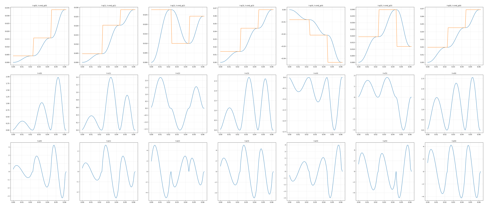
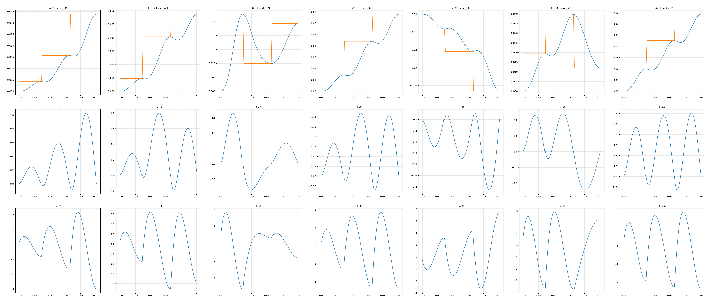
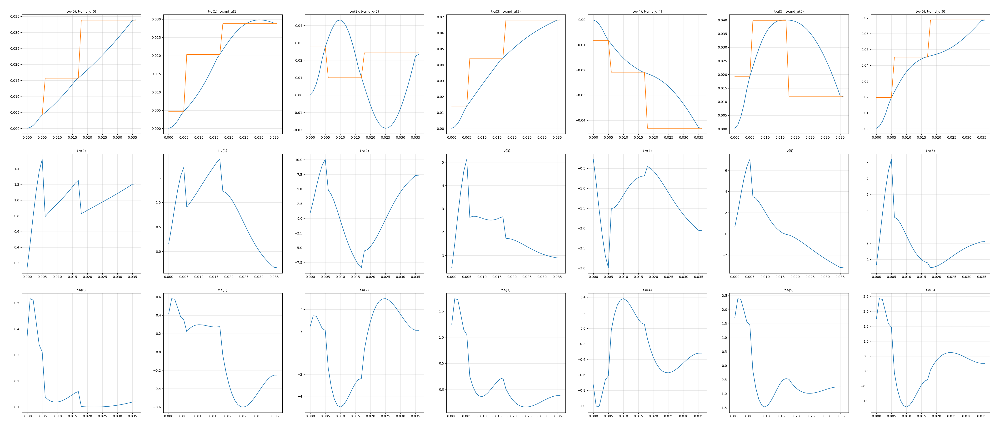

# OBVP_Planner
## Summary
OBVP_planner is a parameterized (interpolation) trajectory planner developed for the obvp problem.During initialization, inputs are the planning dimension, initial state, maximum velocity and acceleration, and a time cost weight (a larger value results in a faster planned trajectory).When using it, you only need to enter the target state and step size dt, and obvp_planner will calculate the expected position based on the currently stored robot state.

Currently, there are three planning methods:

 (1)*getCurrentOutput_EPVA* (needs to input the third-order target, i.e., target position, velocity, and acceleration):


 (2)*getCurrentOutput_EPV* (needs to input the second-order state of the target, i.e., target position and velocity):

 
 (3)*getCurrentOutput_EP* (needs to input the first-order state of the target, i.e., target position):



## Tutorial
### C++
```c++
ObvpPlanner planner(iniState, 7, max_vel, max_acc, 0.1);
Eigen::VectorXd q = planner.getCurrentOutput_EPVA(tar_state, dt);
```
See src/obvp_planner_test.cpp for details.

### Python
Run
```shell
rm -r ./include/obvp_planner/build && rm -r ./include/obvp_planner/obvp_planner.egg-info &&
pip install ./include/obvp_planner --verbose
```
Install obvp_planner into Python

If pip prompts that #include <Eigen/Core> cannot be found, you can add a soft link by:
```shell
sudo ln -s /usr/include/eigen3/Eigen /usr/local/include/Eigen
```

then
```python
from obvp_planner import ObvpPlanner
planner = ObvpPlanner(initial_state, dof, max_vel, max_acc, weight_T)
output_q = planner.getCurrentOutput_EPVA(tar_state, dt)
```
See scripts/obvp_planner_test.py for details.

### Start mujoco
Start roscore first, and then
```shell
pip install mujoco-py
python3 ./scripts/start_mujoco.py
```